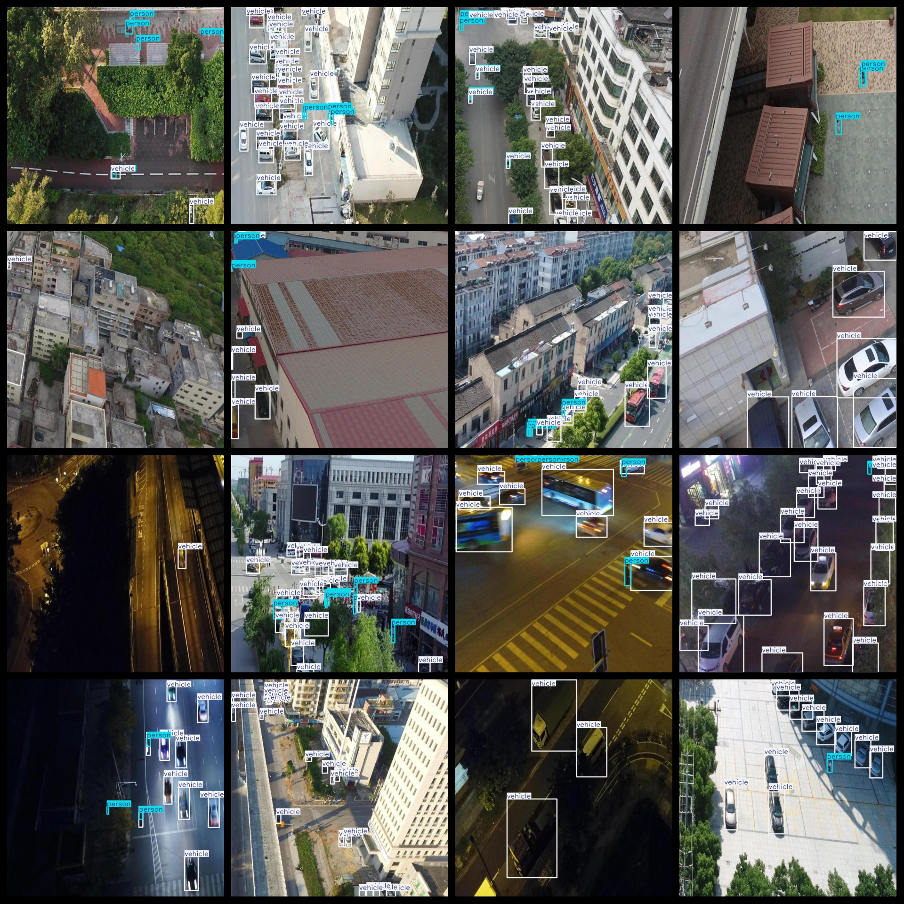
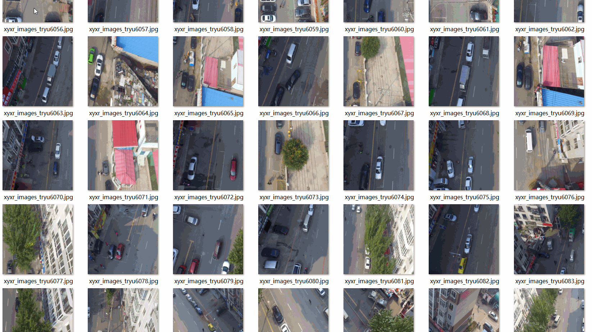

# UAV Aerial Ground Person Vehicle Animal Dataset 23381 imagesVOC+YOLO format

The dataset consists of aerial images of ground people, vehicles, and animals, with the annotation format supporting both VOC and YOLO. The package includes three folders: JPEGImages, Annotations, and labels, each containing relevant files such as JPEG images, XML annotations, and txt labels.

The total number of JPEG images within the JPEGImages folder is 23381. The XML annotations in the Annotations folder total up to 23381, while the txt labels in the labels folder amount to 23381. There are a total of 3 label categories: "Animal-", "person", and "vehicle".

The box numbers for each category are as follows:
- Animal: 1736 boxes
- Person: 105735 boxes
- Vehicle: 236187 boxes

Total box count: 343658

The image resolution is clear, and there is no enhancement applied to the images. The repository location is datasets_sl. The labeled shapes are rectangular boxes used for object detection recognition.

Important Notes: No specific accuracy guarantees are made regarding the models trained on this dataset or any weight files. This dataset provides accurate and reasonable annotations only.

Annotations and Images Details:

## Images

---

Here is a pay link on Stripe (https://buy.stripe.com/3cs8yP7sY87d0vu9AB). Please contact me lonlonago@foxmail.com after funding $89, and I will send you a complete data files, thank you!

